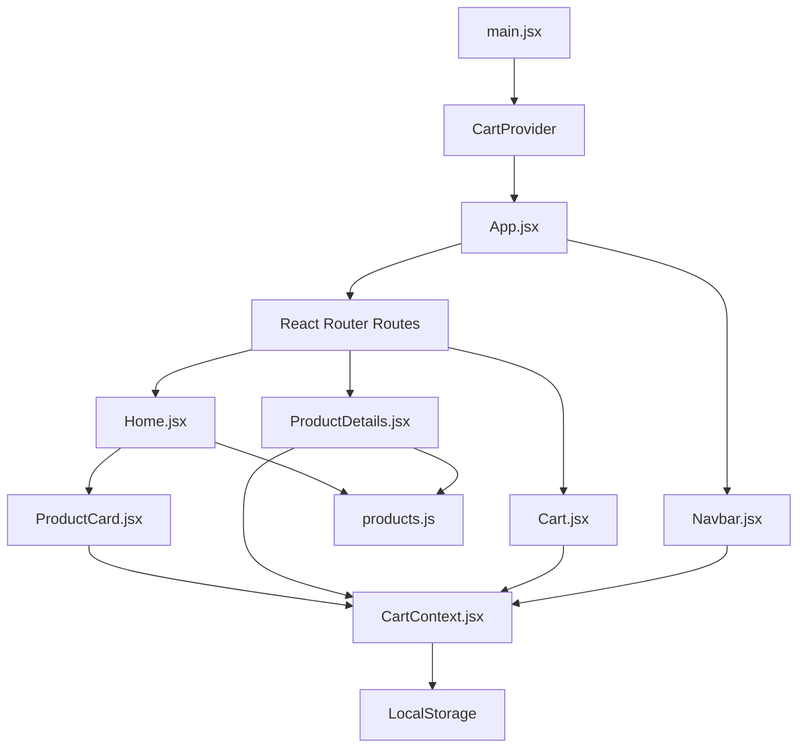
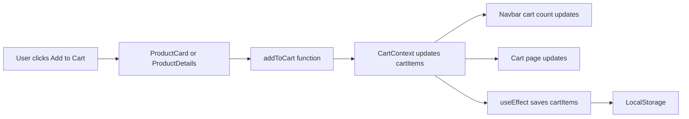

# ShopEase - React E-commerce Frontend

ShopEase is a responsive e-commerce frontend project built using React.js.
It includes product listing, product details, search, category filtering, price sorting, cart management, quantity update, remove from cart, and cart persistence using LocalStorage.

## Live Demo:
 https://deshrajvermay9517-png.github.io/shopease-react-ecommerce/

## Features

* Product listing
* Search products
* Category filter
* Sort products by price
* Product details page
* Add to cart
* Increase and decrease quantity
* Remove item from cart
* Clear cart
* Cart total calculation
* Cart data saved in LocalStorage
* React Router navigation
* Context API for global cart state
* Responsive design

## Tech Stack

* React.js
* JavaScript
* CSS
* React Router
* Context API
* LocalStorage
* Vite

## Folder Structure

```text
src/
│
├── components/
│   ├── Navbar.jsx
│   └── ProductCard.jsx
│
├── context/
│   └── CartContext.jsx
│
├── data/
│   └── products.js
│
├── pages/
│   ├── Home.jsx
│   ├── ProductDetails.jsx
│   └── Cart.jsx
│
├── App.jsx
├── main.jsx
└── index.css
```

## Project Architecture Diagram



## Cart Workflow Diagram



## How This Project Works

The React application starts from `main.jsx`.
In `main.jsx`, the `App` component is wrapped inside `CartProvider`, so the cart data becomes available globally.

`App.jsx` handles routing using React Router. It connects different pages like Home, Product Details, and Cart.

`Home.jsx` imports product data from `products.js`, applies search, category filtering, and sorting logic, then passes each product to `ProductCard.jsx`.

`ProductCard.jsx` displays each product and allows users to add products to the cart.

`ProductDetails.jsx` uses the product ID from the URL and displays detailed information about a selected product.

`CartContext.jsx` manages the global cart state. It contains functions like add to cart, increase quantity, decrease quantity, remove item, clear cart, total items, and total price.

`Cart.jsx` displays all cart items and allows users to update quantity, remove items, clear cart, and see total price.

Cart data is saved in LocalStorage using `useEffect`, so it remains available even after page refresh.

## React Concepts Used

* Components
* Props
* useState
* useEffect
* useContext
* Context API
* React Router
* useParams
* Conditional rendering
* List rendering using map
* Events
* LocalStorage
* Array methods like map, filter, find, and reduce

## Future Improvements

* API integration
* Login and signup
* Wishlist feature
* Payment page UI
* Backend integration
* Admin product management
* Product reviews and ratings
